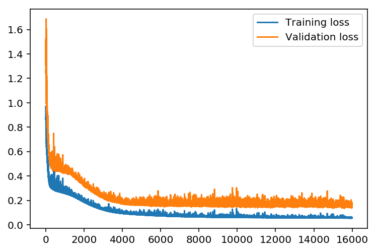
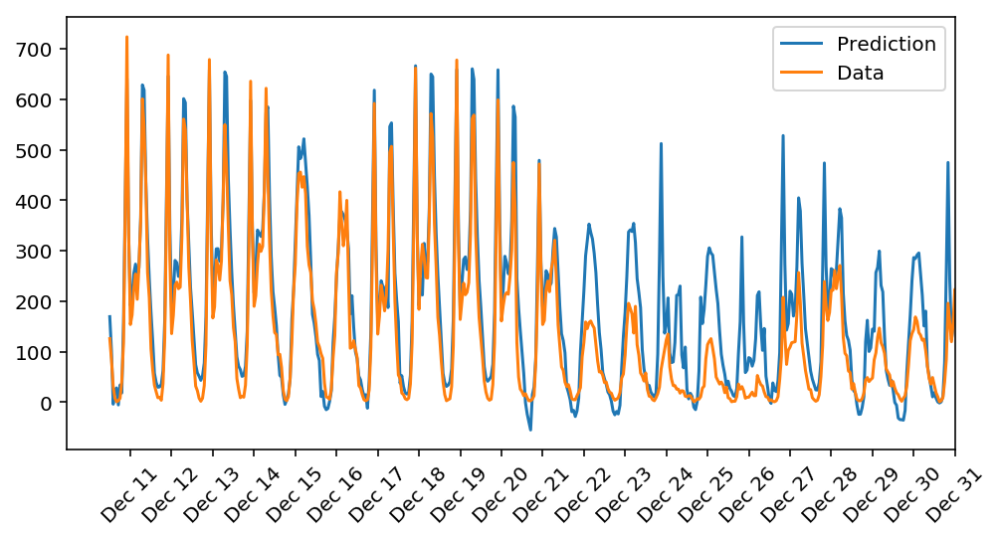

# Bike-sharing-pattern

## Introduction

In this project, you'll build your first neural network and use it to predict daily bike rental ridership. We've provided some of the code, but left the implementation of the neural network up to you (for the most part). After you've submitted this project, feel free to explore the data and the model more.

## getting started
The data is already provided for you in ./Dataset/hour.csv , ./Dataset/day.csv and you're encouraged to open that file and look at the csv.

As a first step, we'll load in this data and look at some samples.
Then, you'll be tasked with defining and training a Neural Network to generate a bike sharing predictions!

## Prerequisites

* Python 3.
* Numpy 
* Pandas
* MatPlotLib

## Project Instruction

### Instructions
1. Clone the repository and navigate to the downloaded folder.
	```	
	git clone https://github.com/shyamStarwalt/Bike-sharing-pattern.git
	```
2. Download and Install Anaconda [from here](https://www.anaconda.com/)

3. Install the above packages mentioned in the Prerequisites (Anaconda Prompt)

4. Open the cloned repository and navigate to
	```
	cd Bike-Sharing-pattern
	```
5. Open the Your_first_neural_network.ipynb.ipynb
	```
	jupyter notebook Your_first_neural_network.ipynb.ipynb	
	```
6. Read and follow the instructions!  

## Project Information

### Contents

- Intro
- Step 0: Import Datasets
- Step 1: Implement Pre-processing Functions
- Step 2: Build the Neural Network
- Step 3: Train the Neural Network
- Step 4: Generate the bike share pattern

## Losses

### Model scratch:
Training loss: 0.058 ... Validation loss: 0.142



## Output

